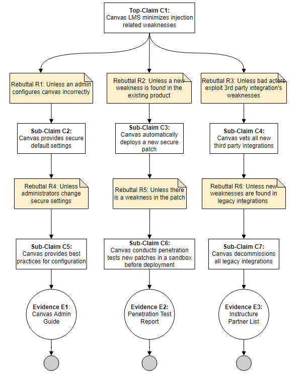

# CYBR-8420 Assurance Cases

## Link to Project Board
[Click here to view the board](https://github.com/users/jschrack/projects/4/views/1)

---

## Claims

### **Claim 1 - Augusto**

**Part 2 Assessment** - 

----

### **Claim 2 - Canvas LMS Minimizes Unauthorized Access**

**Part 2 Assessment** - 

*E1 - Compliance Report*: Canvas LMS product compliance packages are available upon request at: [Canvas Compliance Report](https://www.instructure.com/trust-center/resources). While Canvas LMS offers access to compliance reports, it is unclear how reliable delivery is upon request. Additionally, it's uncertain whether these reports contain adequate details regarding critical security features like MFA or incident response information.  

*E2 - Penetration Test Results*: Penetration testing is completed annually through Bugcrowd, Inc. and the reports are availabe on the Instructure site. The latest report can be found at: [Canvas LMS Pentestig Report](https://www.instructure.com/sites/default/files/file/2023-04/Canvas_Security%20Audit_Report_2023.pdf). Potential gaps in pentesting results may include a limited testing scope, an insufficiently comprehensive methodology that fails to identify all types of XSS vulnerabilities, or uncertainty about whether the test was conducted in a test environment or the live production environment.

*E3 - Security Audit Logs*: Instructure maintains a Security Overview document that covers physical security for data centers, detailing the use of state-of-the-art electronic surveillance and multi-factor access control systems. Data centers are protected 24/7 by trained security guards and access is authorized strictly on a least-privileged basis. Security Audit Logs are available for review by security staff with appropriate levels of access. The Security Overview document can be found at: [Canvas LMS Security Overview Policy](https://www.instructure.com/trust-center/resources). A potential gap for review of security audit logs is human error, poor log retention policies, or inadequate review frequency.

----

### **Claim 3 - Geoff**

**Part 2 Assessment** - 

----

### **Claim 4 - Jesse**

**Part 2 Assessment** - 

----

### **Claim 5 - Mark**

**Part 2 Assessment** - 
*E1 - Canvas Admin Guide*: Canvas provides a comprehensive guide on how to configure many different pieces. Due to the size of canvas documentation does get hard to navigate, but it does provide a guide for many settings that protect against injection related weaknesses.This is listed on their community site: [Canvas Admin Guide](https://community.canvaslms.com/t5/Admin-Guide/tkb-p/admin). The biggest potential gap is the human error of implementing all steps and understanding of what is needed. 

*E2 - Penetration Test Report*: The Canvas LMS Security Audit Report 2023: [Penetration Test Report](https://www.instructure.com/sites/default/files/file/2023-04/Canvas_Security%20Audit_Report_2023.pdf) provides a detailed review of the security measures in place for Canvas LMS. It outlines the methodology used, including bug bounty programs, and discusses the types of vulnerabilities identified. The report summarizes the findings for 2022 and highlights improvements made to strengthen Canvas' security posture. The gaps may be possibly missing a vulnerability in testing that was not remediated, or if there are physical security issues that may create weaknesses.

*E3 - Instructure Partner List*: You can find documentation for all integrations including an individual guide per each integration: [Instructure Partner List](https://community.canvaslms.com/t5/Partners/ct-p/partners). The major gap in this list would be that it does not notify a user of an integration becoming legacy. The integration is simply removed from the list for future use, but extra steps would need to be taken to notify all current users. 

## Alignment of Evidence Assessment
We can add a short summary of the individual assessments here or just remove

## Team Reflection

