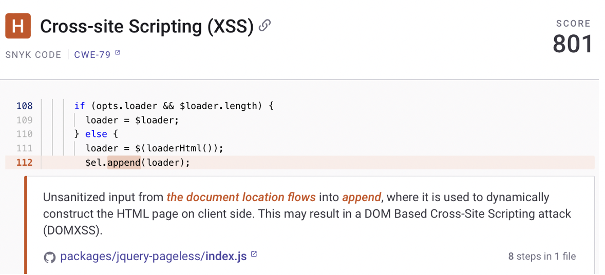
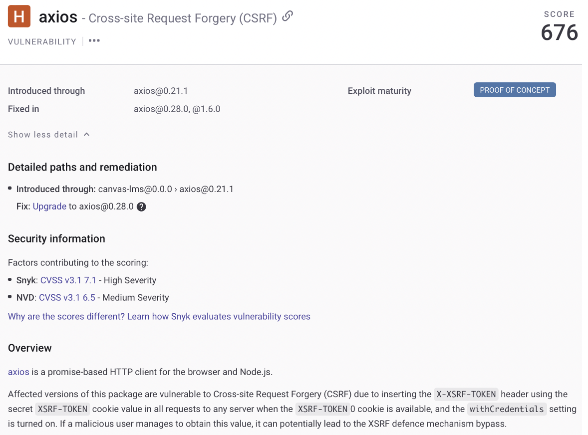
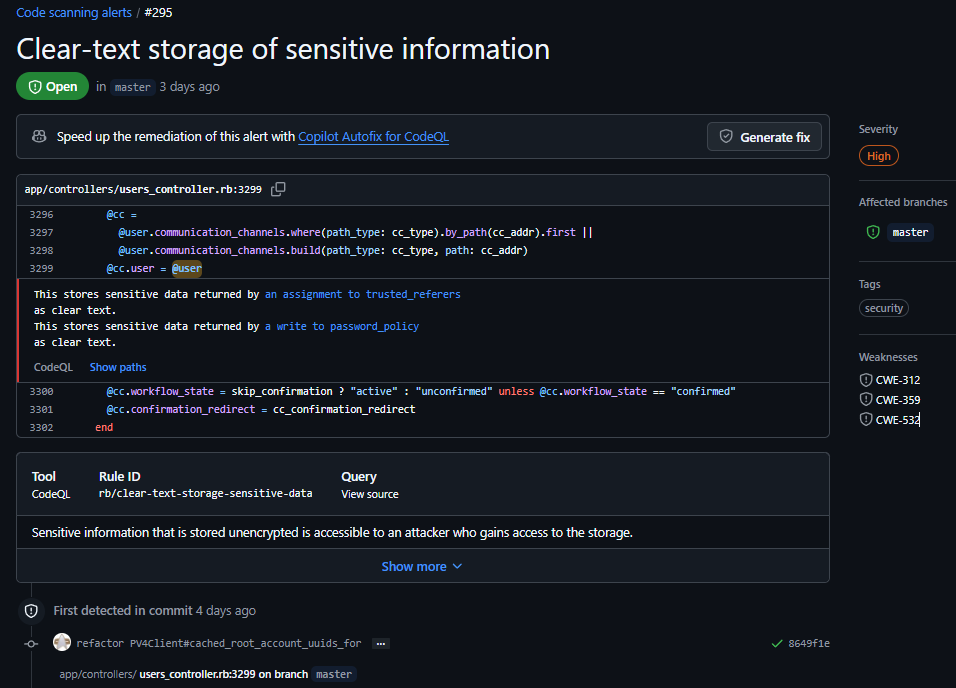
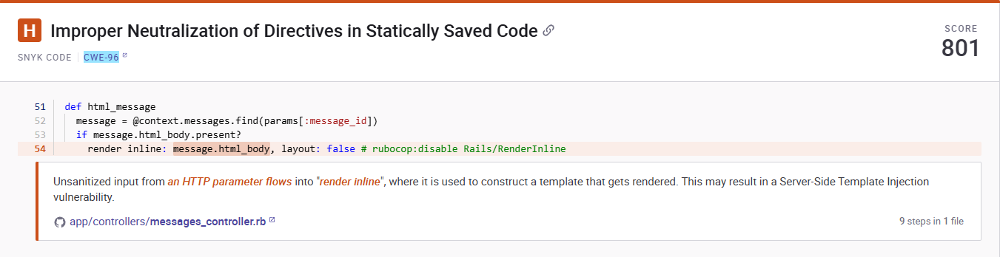
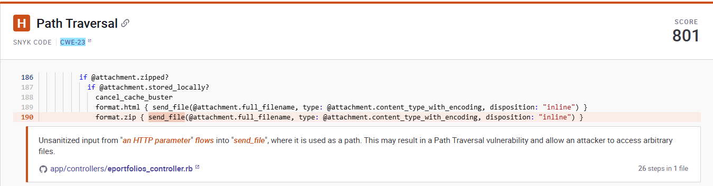

# CYBR-8420 Code Analysis for Software Security Engineering

## Link to Project Board
[Click here to view the board](https://github.com/users/jschrack/projects/6/views/1)

## Code Review Strategy

Our team began by determining the relevant code modules from our previous misuse and assurance cases. We each chose a few CWEs that related to our modules. From there, we looked at the list of the 2024 CWE top 25 most dangerous software weaknesses from the Mitre site to further narrow down our CWEs that we wanted to focus on. Finally, using a combination of manual and automated tool review, we drilled down into the code to analyze potential vulnerabilities. 

### Relevant Code Modules
Based on our misuse cases, assurance claims, and threat models, the following modules/files have been determined to be within scope:
- Authentication and Authorization
    - Access controls properly implemented
    - Securely managed session tokens
    - Hardcoded credentials
    - 2FA implementation
- Database and Data Integrity
    - Database config
    - Input validation and sanitization
    - Data Access Layer
- File Handling
    - Path Traversal
    - Access control
    - Secure file handling
- API endpoints relating to grades, users, quizzes
    - Proper authentication and authorization
- Application logging

### CWEs
Identify a list of 5-10 CWEs (as specific as possible) that would be most important for findings from your manual or automated code review. The selection of CWEs will depend on the type of programming language, platform, and architecture of your project. Knowing what you are looking for in a large codebase will help you focus your efforts. This is a checklist-based approach. 

 **1. CWE-918: Server-Side Request Forgery (SSRF)**

 **2. CWE-94: Improper Control of Generation of Code ('Code Injection')**

 **3. CWE-79: Improper Neutralization of Input During Web Page Generation / Cross-site Scripting**

 **4. CWE-352: Cross-Site Request Forgery (CSRF)**

 **5. CWE-89: Improper Neutralization of Special Elements used in an SQL Command ('SQL Injection')**

 **6.  CWE-502: Deserialization of Untrusted Data**

 **7. CWE-532: Insertion of Sensitive Information into Log File**

 **8. CWE-285: Improper Authorization**

 **9. CWE-96: Improper Neutralization of Directives in Statically Saved Code ('Static Code Injection')**
 
 **10. CWE-23: Relative Path Traversal**

### Automated Code-Scanning Tools
Select automated code-scanning tools based on the software composition of your project. One tool may not be enough. If no free and open-source tools are available, see if you can get a free trial version for a few days

 **SNYK** - Uses real time semantic code analysis based on machine learning to determine code issues such as dead code, type inference, data flow issues, API misuse, and type mismatches for Java, JavaScript, TypeScript, and Python.

 **CodeQL** - GitHub's built in code analysis tool for finding vulnerabilites and bugs in codebases. It supports JavaScript/Typescript, Python, and Ruby, which are the languages used by Canvas LMS. The tool can be easily integrated to most codebases and can be setup to run throughout the CI/CD pipeline.

**grep** - The Unix command-line tool `grep` was used in conjunction with the ```find`` utility to look for text strings indicative of potential security vulnerabilities. The grep utility is not designed specifically for scanning code, but it is very useful for locating potential issues for manual analysis.

### Anticipated Challenges
What challenges did you expect before starting the code review?
How did your code review strategy attempt to address the anticipated challenges?

Initially, the vastness of the codebase seemed a bit overwhelming and it seemed challenging to determine where to start. After following our code review strategy and targeting specific code modules from our misuse and assurance cases, it helped us to focus in on particular CWEs and files. 

Also, a lack of familiarity with programming languages was anticipated to be challenging for the manual code review for some team members. Access to resources, such as ChatGPT, helped to overcome this challenge.

## Automated Code Review Findings
Document findings from automated code scanning (if available). Include links to tool outputs

  **CWE-79:** Using SNYK, a scan was executed to look for XSS weaknesses. Complete results are available at: [Canvas-LMS SNYK scan results](https://app.snyk.io/org/peachykeen00/project/129f2d2c-52f6-4b13-8d76-1f819ec1d2d7)
  There were a total of 15 XSS vulnerabilities (6 high, 8 medium, and 1 low severity). An example of one of the XSS vulnerabilities is below, from the packages/jquery-pageless/index.js file:


  **CWE-352:** Using SNYK, the files were scanned in the Canvas-LMS repository on GitHub for CSRF vulnerabilities. There weren't many results with this specific weakness, but there was one specific to Axios, a third-party JavaScript library used to make HTTP requests from a browser. It provides an easy-to-use interface for sending asynchronous requests. The details of the vulnerability are included here:


  **CWE-89:** We scanned the codebase using the command
  
    find ./app -name \*.rb -type f -print0 | xargs -0 grep -iE "\W(SELECT|INSERT|UPDATE|DELETE)\W"
    
  to find SQL queries. This led to a large number of false positives but also revealed many instances where SQL queries were built using string processing rather than with an ORM library or SQL parameterization. This is problematic due to the level of care required to prevent SQL injection when building raw queries (and as a side note, queries that do not use ORM make it much harder to use a NoSQL database with Canvas). Several of these queries are very complex, with dozens of variables that contain user input, and some of the queries appear in functions that are directly responsible for dispatching web API calls.

 **CWE-502:** We performed text searches for the Marshall serialization library and found none in the codebase. Next, we looked for OpenStruct. Canvas does use OpenStruct but only for serialization, not deserialization. Next, we looked for YAML deserialization. Canvas uses YAML deserialization methods in 15 places. Of these, 10 use a `safe_load()` method, which restricts the datatypes that can be deserialized. The remaining 5 were manually reviewed.

  **CWE-532:** CodeQL detected 74 vulnerabilities with all of them having a severity level of high. 14 of the reported issues were related to test cases and can therefore likely be disregarded. An example of one of the detected vulnerabilities in the users controller can be seen below:
  

  **CWE-96:** Using SNYK, the files were scanned in the Canvas-LMS repository on GitHub for SCI vulnerabilities. We found one case of SCI relating to an unsanitized HTTP input. This could lead to a server side template injection weakness.  The details of the vulnerability are included here:


**CWE-23:** Using SNYK, the files were scanned in the Canvas-LMS repository on GitHub for Path Traversal vulnerabilities. We found 4 high vulnerabilities where the send_file method was being used. These cases could lead to improper access of files. This can be achieved through allowing traversal to outside files or directories. The details of the vulnerability are included here:

  
## Manual Code Review Findings
Document findings from a manual code review of critical security functions identified in misuse cases, assurance cases, and threat models.

**CWE-918:** Not being proficient in Ruby, we rely on ChatGPT for identifying vulnerabilities. The main issue found was the following code snippet:

```ruby
connection.post url, params.merge(header.signed_attributes)
```
In this code snippet, we see that url is the endpoint where the request will be sent, params.merge(header.signed_attributes) is the data being sent in the POST request, which includes parameters (params) and additional attributes (header.signed_attributes). The URL appears to be determined dynamically, likely form user input or some external source, if the input is not validated, and attacker can manipulate it to perform an SSRF attack.

 **CWE-94:** Not being proficient in Ruby, we rely on ChatGPT for identifying potential vulnerabilities. During the review we found some potential critical Code Injection. Below are examples of flagged code:

1. **`model = Object.const_get(params[:context_type])`**  
   - **Issue**: The execution of this code depends on the user-provided value `params[:context_type]`.  

2. **`@context_class = Object.const_get(@context_type, false)`**  
   - **Issue**: The execution of this code depends on the user-provided value `@context_type`.  

3. **`scope = source.send(type).select(:id).except(:preload)`**  
   - **Issue**: The execution of this code depends on the user-provided value `type`.  

Further investigation is required to verify whether the input is being properly validated to prevent attackers from manipulating the code, any user-controlled input could potentially be used for malicious code execution.

 **CWE-502:** We reviewed the source files containing the five instances of YAML.load(). In all five of these instances, the serialized data should consist of simple associative arrays. In one instance, the source code, last updated in 2011, puts the YAML through a series of complicated transformations involving multiple regular expressions, intended as a workaround for some bug. It is unclear to what extent the YAML data used in the YAML.load() statements is under control of a user, but it contains a "title" field, so transforming it with regular expressions and trusting the results may be dangerous. Since the datatypes being deserialized should not consist of polymorphic datatypes, the simplest mitigation would be to change all five instances of `YAML.load()` to `YAML.safe_load()`.

  **CWE-79:** Not being proficient in Javascript, ChatGPT was used to further investigate code from the packages/jquery-pageless/index.js file that was included in the automated XSS tool results. The analysis returned the following results from that file:
  
1.	*settings.loaderImage*
      -The loaderHtml function embeds the settings.loaderImage directly into the src attribute of: img src= + settings.loaderImage + alt=loading more results style=margin:10px auto 
      -Risk: If settings.loaderImage is user-controllable and not validated, an attacker could inject a malicious URL or JavaScript scheme (javascript:alert('XSS')), leading to XSS.
2.	loaderMsg
      -The loader message is set via settings.loaderMsg: $('#pageless-loader .msg').html(opts.loaderMsg);
      -Risk: Directly injecting loaderMsg into .html() without escaping exposes the application to XSS if the message contains malicious HTML or JavaScript.
3.	*Dynamic Data Injection ($.get Response)*
      -The AJAX request appends data received from the server into the DOM: loader ? loader.before(data) : element.append(data);
      -Risk: If the server response (data) includes malicious scripts and the content is appended to the DOM without sanitization, this could lead to XSS.
4.	*settings.scrape*
      -The settings.scrape function is applied to the AJAX response: var data = $.isFunction(settings.scrape) ? settings.scrape(data, xhr) : data;
      -Risk: If the custom scrape function introduces untrusted data or modifies the response insecurely, this could result in XSS when appended to the DOM.

   **CWE-352:** Not being proficient in Ruby, ChatGPT was used to analyze files that had returned CSRF vulnerabilities in the CodeQL scan. The results from the app/controllers/lti/ims/authentication_controller.rb file are as follows:
   1.	Skipped CSRF Protection
        -In the authorize_redirect method: *skip_before_action :verify_authenticity_token, only: :authorize_redirect*, CSRF protection is explicitly skipped, which is a common indicator of potential CWE-352 risks. This allows the endpoint to be accessed without verifying the legitimacy of the request's origin.
2.	Open Redirect Possibility
        -The authorize_redirect_url method constructs a redirect URL based on user input (lti_1_3_authorization_url), which uses oidc_params. If input validation or sanitization of redirect_uri in oidc_params is insufficient, this could be abused to redirect users to malicious sites.
3.	Strong Parameter Enforcement
        -The oidc_params method ensures that only expected parameters are permitted: *params.permit(*(OPTIONAL_PARAMS + REQUIRED_PARAMS))*, however, the contents of redirect_uri are not validated against a strict whitelist, which might enable attackers to manipulate redirects.
4.	Contextual Validations
        -The code performs several validations (e.g., validate_oidc_params!, validate_client_id!, validate_current_user!) to ensure the request is legitimate. These are robust checks against certain kinds of abuse but do not directly address CSRF.

 **CWE-285:**
 1. **app/controllers/gradebooks_controller.rb**
    - No issues identitied in this controller related to CWE-285 based on ChatGPT and manual analysis.
 2. **app/controllers/user_controller.rb**
    - No issues identitied in this controller related to CWE-285 based on ChatGPT and manual analysis.
 3. **app/controllers/admins_controller.rb**
    - Using ChatGPT it mentioned potential issues with the destroy and create endpoints as the role_id is not being validated on input. However, after manual code review, it has been determined to not be an issue since it is checking for a user with matching user ID and role ID. Therefore if an invalid role ID is passed then the user account will not be found and the action will not be completed.
 4. **app/controllers/profile_controller.rb**
    - No issues identitied in this controller related to CWE-285 based on ChatGPT and manual analysis.
 5. **app/controllers/tokens_controller.rb**
    - No issues identitied in this controller related to CWE-285 based on ChatGPT and manual analysis.
 6. **app/controllers/quizzes/quizzes_controller.rb**
    - No issues identitied in this controller related to CWE-285 based on ChatGPT and manual analysis.
 7. **app/controllers/quizzes/quizzes_controller.rb**
    - No issues identitied in this controller related to CWE-285 based on ChatGPT and manual analysis.
 8. **app/controllers/files_controller.rb**
    - No issues identitied in this controller related to CWE-285 based on ChatGPT and manual analysis.

## Summary of Findings
Provide a summary of findings from manual and/or automated scanning. This summary should include mappings to CWEs to describe significant findings and perceive risk in your hypothetical operational environment.

  **CWE-79:** CodeQL returned several more instances of potential XSS file vulnerabilities than SNYK. The results from SNYK are mostly consistent with the manual code analysis, with the manual analysis returning a bit more detail.

  **CWE-352:** There were not many instances found with SNYK for CSRF, but CodeQL did return several potential files with vulnerabilities. Using manual code review with ChatGPT, a significant amount of detail was revealed.

  **CWE-532:** CodeQL identified 74 potential issues with 60 of them relating to non-test modules/files. The issue reported is clear-text storage of sensitive information. After performing manual review of the findings reported by the automated tool, it seems this issue needs to be explored further. Many of the reportings are related to the values stored with the @current_user context object. After analyzing that object, it seems that sensitive information like access keys or passwords are stored in a secure format while non-sensitive information is stored in clear-text. This eliminates many of the detected issues but requires the rest of them to be investigated independently.
  
  **CWE-918:** There was only one instance of this CWE being triggered and found manually (by luck). Initially found manually and after running Github Code Scanner, it confirmed our suspicions. The code can potentially be used for Server-Side Request Forgery, more investigation needs to be done.
  
  **CWE-94:** Initially after researching CWE-94 and asking Chatgpt to give examples, we started to manually review the code and found at least three potential examples. To verify we ran a GitHub Code Scanner and confirmed our suspicions and showed a lot more. It is not surprising that Canvas-LMS has user input, but we need to do further research to verify that the sanitation and verification of the user input is properly done

 **CWE-96:** We only found one case of CWE-96 in review but deemed it to be of high importance. This is due to it allowing unsanitized HTTP which could lead to greater vulnerabilities.

  **CWE-23** Through the automated review we found 7 cases of CWE-23. These all relate to the send_file method and fs. commands being used with unsanitized input. 

  **CWE-502:** Manual review revealed five uses of the unsafe deserialization function YAML.load() when a safe alternative would be more appropriate. One of these unsafe serializations is performed on data containing a "title" field that is deliberately unescaped and then re-escaped in an ad-hoc manner prior to deserialization. We highly recommend the use of safe deserialization methods.

  **CWE-89:** Automated scans uncovered approximately 100 SQL queries that were generated with Ruby format strings rather than with a parameterization library or ORM. Many of these queries involve dozens of variables, several of which are under user control. Some are generated in functions that are directly accessible via web APIs. We recommend limiting the use of raw SQL generation with user-controlled variables with an ORM library and/or parameterization, as well as input validation.
  
## Planned Contributions
Our planned contribution involves conducting a thorough review of the Canvas-LMS codebase to identify potential vulnerabilities that could impact the platform's security. By analyzing the code, we aim to pinpoint at least one area where we can make meaningful contributions to the open-source community. Given that Canvas-LMS is a tool widely used by students, educators, and institutions, enhancing its security is not only a valuable contribution to the broader community but also a step toward safeguarding the platform for all users, including ourselves. Through our efforts, we hope to ensure a more secure and reliable learning management system for its global audience.

## Team Reflection
The team worked well together for this assignment. We worked together early on to determine our way forward and everyone showed up to each scheduled meeting, prepared to contribute. There was continuous communication throughout the week and everyone was respectful and constructive with inputs and feedback.
