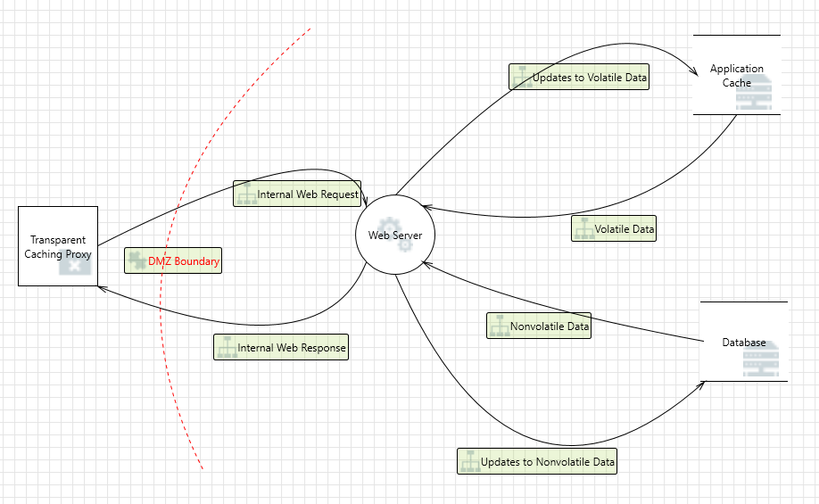

# CYBR-8420 Designing for Software Security Engineering

## Link to Project Board
[Click here to view the board](https://github.com/users/jschrack/projects/5/views/1)

---

## Data Flow Diagram

[Threat Modeling Report](https://jschrack.github.io/CYBR-8420/Deliverables/Designing%20for%20Software%20Security%20Engineering/threat_modeling_report.html)

## Part 2 Observations

After reviewing the threat modeling report, we concluded as a team that the following numbers need more investigation: Elevation by Changing the Execution Flow in Web Server, Potential Lack of Input Validation for Web Server, Spoofing of Source Data Store Database, and Spoofing of Destination Data Store Database

Canvas LMS is designed with security in mind, but like any software platform, it may still be susceptible to vulnerabilities. One potential design-related gap highlighted by the DFD analysis is the absence of certifcate-based validation for the database. This feature is supported by Canvas, but no recommendation for it is made in the supporting documents.

Another potential design gap could be privilege elevation by changing the execution flow in web server. The web server software should use validation on every input stream (updated with new vulnerability finds), as well as control flow integrity checks with page protection, stack overflow detection, heap corruption detection, and code integrity checks to prevent attackers from altering the web server’s execution flow.

Canvas LMS may suffer from missing input validation within the codebase. Since there are many places where validation would need to be verified, this issue still needs to be investigated and mitigated. We would suggest using standard techniques for finding input validation flaws such as taint checking and output validation, as well as further code review. One promising new approach that could augment these efforts is the use of AI tools to find validation errors. In the spots that we manually checked, proper input validation and sanitization were in place.

While Canvas LMS seems to implement a robust network security strategy, past evaluations have uncovered vulnerabilities in its security measures. For instance, although the platform provides protections against CSRF and XSS attacks, this does not guarantee that its mitigation capabilities are entirely free of flaws or limitations.

## Team Reflection

This week’s assignment was a bit different from the previous ones in terms of dividing the workload and coordinating our inputs. In the last two assignments, each team member was responsible for creating a diagram. However, for this assignment, we quickly determined that only one diagram was needed. One teammate took on the task of creating and updating the diagram, while the rest of us divided up the threats. Afterward, we had to determine the best way to coordinate and compile our inputs, as GitHub didn’t seem practical for this purpose. Most of our coordination was done through Discord via chat and voice discussions. We also used Google Sheets to merge and edit threat mitigations. Filtering updates through GitHub felt more cumbersome compared to completing our individual portions and then meeting to consolidate them into a single HTML file. Ultimately, we adapted and successfully completed the assignment.
