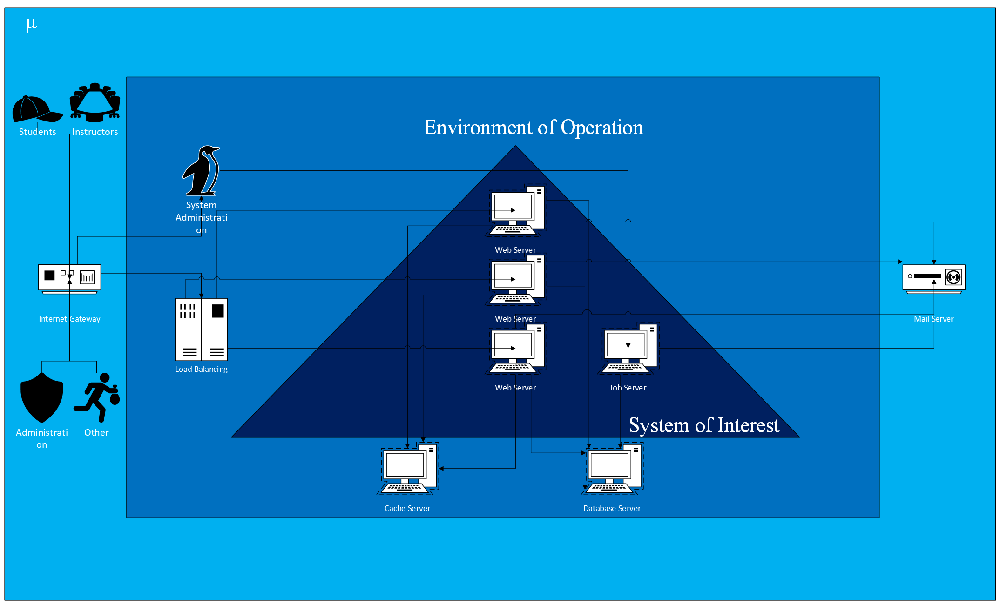
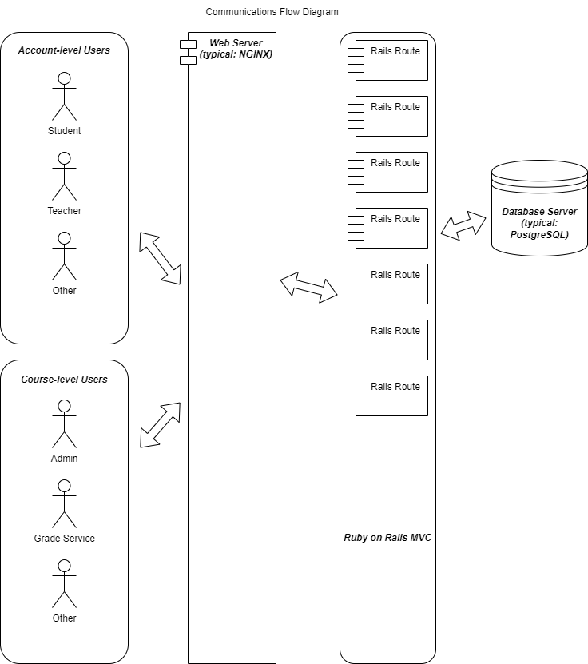

# CYBR-8420 Project Proposal

## Team Members
- Augusto Zorrilla Mendez
- Deb Peterson
- Geoff Humphreys
- Jesse Schrack
- Mark Magno

---

## Link to Project Board
[Click here to view the board](https://github.com/users/ghumphr/projects/1/views/1)

---

## Typical Operating Environment

Canvas LMS is typically hosted on a POSIX system, usually Linux, but OS X is also supported. It requires at least 8 GB of RAM.

Canvas requires several supporting servers. It is possible to host all of the servers on a single machine, but they can also be partitioned across Docker containers, across cloud servers, or even across multiple bare metal machines. Instructure uses AWS to host subscription Canvas instances.

### Running Canvas requires the following servers:
* **Web server aka appserver** (typical: NGINX, Apache also supported)
* **Database server aka dbserver** (typical: PostgreSQL)
* **Job server** (typical: Ubuntu, often hosted on the same machine as the appserver)

Most configurations will also use a mail server. Many configurations will use an application server alongside the web server to simplify administration and/or improve performance. The web server should be configured to use SSL, either directly or otherwise, which will require a certificate issued by a certificate authority.

Canvas uses its own rich content editor. Canvas supports username/password logins and also OAUTH.

Canvas can achieve greater performance when using cache servers. Memcache and Redis are supported, but Redis is recommended by the authors. Amazon ElastiCache provides interfaces that are compatible with both Memcache and Redis, so it is reasonable to suppose that its use is typical.

### Advanced configurations can provide for:
* Load balancing with multiple web servers
* Redundant database servers
* Offsite backup
* Encrypted database volumes (typically using AWS KMS)

**Instructure requires that database volumes used by subscription instances be encrypted.**

Canvas LMS depends heavily on the Ruby on Rails framework and uses the Ruby Gems package management framework. It also uses Bundler to manage dependencies/versions. It can use NPM for managing JavaScript dependencies, but Yarn is preferred. Canvas also requires NodeJS.

During configuration, Canvas requires admins to enter their own security keys, which are stored in the security.yml configuration file.

### Hypothetical Operating Environment Example:
* **Cloud provider:** AWS
* **Operating system:** Ubuntu
* **Web server:** NGINX
* **Mail server:** Mailgun SMTP
* **Load balancer:** Elastic Load Balancing
* **SSL certificate:** LetsEncrypt
* **Authentication:** SAML
* **Cache:** Amazon ElastiCache
* **Database:** Redundant PostgreSQL databases hosted with Amazon Redshift
* **Encryption:** KMS
* **Backup:** Daily offsite backup

### Potential Attack Vectors
* **Database server:** While database server vulnerabilities are largely out of scope of this project, it remains a significant risk.
* **Web server:** As the public-facing component, the web server is a prime target. Its dependencies can also introduce vulnerabilities.
* **Job server:** Access to the database could be gained through compromising the job server.

### Diagram of Operational Environment

### Communication Flow Diagram

### Threats Perceived by Users

In our environment, Canvas-LSM is mainly used by students and professors across the country. There are thousands of users who store their password and student ID on Canvas, and they also assume that their grades and information will stay private. As users ourselves of Canvas-LSM, we must consider some of the perceived users we see as students.

- **Black Hat Hacker**: An individual who would try to gain access to the password/username database to obtain system credentials. The attacker would be acting maliciously, to release the grades of students, release papers or homework of students submitted. Malicious actors can also use student credentials to access online library resources for research papers and other information.
  
- **Malicious Contributor**: A bad actor or actors can contribute to open-source projects maliciously. They can pretend to be good contributors, gaining access to the project if they need to request permission. A malicious contributor could do damage initially or wait until later to change code that will benefit them, such as collecting personal information of students, homework, or creating vulnerabilities intentionally.
  
- **Potential DocViewer Vulnerability**: The vulnerability with DocViewer will allow unauthorized access to locked or unpublished files through a specific URL. Breaking the CIA triad of Confidentiality, this could let a student see a test ahead of time or quiz, giving them the opportunity to steal it or be better prepared.
  
- **Potential Cross-Site Scripting (XSS) Vulnerability**: Cross-site scripting is a type of security vulnerability that can be found in some web applications. The malicious actor can inject client-side scripts into a web page viewed by others, letting them bypass access controls. This could be used to see everyone’s grades, personal information, steal information from unreleased papers/exams, steal the exams if they are all uploaded but not available for view by students, and much more.
---

## Motivation

---

## Software Description

---

# Open-source Project Description

## What is it?
Canvas LMS (Learning Management System) is an open-source e-learning platform developed by Instructure. It is designed to facilitate teaching and learning by providing an intuitive and robust digital classroom experience. Canvas offers tools for creating and managing online courses, including communication, grading, assignments, quizzes, and collaborations.

## Contributors
Canvas LMS is primarily maintained by Instructure, the company that developed it. However, since it is open-source, contributions come from a broader community, including educators, developers, and organizations that extend or customize the platform. The core contributors are primarily Instructure employees, but outside developers contribute through bug fixes, feature enhancements, plugins, and integrations.

## Activity
Canvas LMS is an actively maintained project with regular releases and updates. It receives continuous development through GitHub, where Instructure and the community contribute to improvements. The repository has numerous contributors actively addressing issues, fixing bugs, and adding features based on user feedback. The activity is consistent, with frequent commits and discussions around issues and pull requests.

## Use
Canvas LMS is widely used across the globe in educational institutions of all sizes, from small schools to large universities, as well as in corporate environments for employee training. Its flexible, scalable nature allows it to be customized to meet various needs in both formal education and professional development contexts. Canvas is used to facilitate online, hybrid, and traditional in-person courses.

## Popularity
Canvas is one of the most popular LMS platforms worldwide, competing with other major LMS solutions such as Blackboard, Moodle, and Google Classroom. It has a large user base in higher education. Its open-source version, though used by fewer institutions compared to its hosted SaaS counterpart, still enjoys significant adoption by institutions looking for customizable, self-hosted solutions.

## Languages Used
Canvas LMS is primarily written in Ruby and JavaScript. Additionally, HTML, CSS, and other web technologies are used throughout the platform.

## Platform
Canvas LMS is a web-based application, and it is platform-agnostic. It runs on modern web browsers across different operating systems, including Windows, macOS, Linux, Android, and iOS. Canvas also provides mobile apps for Android and iOS to enhance accessibility for both students and instructors.

## Documentation Sources
Canvas LMS has extensive documentation available to developers and users. Key sources include:

- [Canvas LMS GitHub Repository](https://github.com/instructure/canvas-lms): This is the primary source for developers, containing the source code, issues, and contribution guidelines.
- [Canvas LMS API Documentation](https://canvas.instructure.com/doc/api/): Comprehensive documentation for developers working with Canvas APIs to extend functionality or integrate with other systems.
- [Canvas Guides](https://community.canvaslms.com/t5/Canvas-Guides/ct-p/canvas_guides): Official user and instructor guides that cover everything from course creation to grading and collaboration tools.

## Licenses, Agreements, and Contributing

### License

**GNU AFFERO GENERAL PUBLIC LICENSE (AGPL)-3.0, Version 3, 19 November 2007**

[Copyright © 2007 Free Software Foundation, Inc.] (http://fsf.org/)

This is a free, copyleft license for software specifically designed to ensure cooperation with the community. General Public Licenses assert copyright on the software and give you permission to copy, distribute, and/or modify the software.

### Contributing

**Contributor License Agreement**

All contributors must sign a contributor license agreement (CLA) before pull requests will be accepted. Once a pull request is submitted, a status check will indicate whether a signature is still required or not. If the check fails, click on Details and complete the form. The CLA check on the pull request should be successful upon completion of the web form.

**Contributor Code of Conduct**

Contributions can be made to Canvas through filing issues or submitting pull requests. To ensure a respectful, harassment-free experience for contributors and maintainers of this project, any inappropriate material will be removed, edited, or rejected. Examples include sexual language or imagery, derogatory comments, harassment, or other unprofessional behavior. Incidents may be reported by contacting the project maintainers or through opening an issue.

---

## Security-related History For The Software

Canvas LMS has faced several security issues over the years. Some notable issues that were listed in Instructure’s Penetration Test Results report in May 2020 [Instructure Past Security Issues] (https://www.instructure.com/sites/default/files/file/2021-01/Instructure-Penetration-Test-Results-May-2020.pdf) include:

- **Critical (Priority 1)**
  - Leak of app Authorization token via Image with data-api endpoint (Sensitive Data Exposure)
  - ePortfolio export will bypass all access controls for files (Broken Access Control)
- **High (Priority 2)**
  - XSS in Group Wiki Pages via Prerequisites lookup exploit (Cross-Site Scripting)
  - Access to submission/comments media (Broken Access Control)
- **Medium (Priority 3)**
  - CSS in Canvas Quizzes via malicious response from server (Cross-Site Scripting)
  - Users can see automatically graded scores on muted or hidden assignments (Server Security Misconfiguration)
- **Low (Priority 4)**
  - Open Redirect (Unvalidated Redirects and Forwards)
  - Course members without permission to view grades can download all quiz submissions (Broken Access Control)
 
Canvas LMS participates in a bug bounty program through Bugcrowd, Inc. and has addressed the above listed security issues through the release of patches and updates. Instructure performs application assessment and penetration testing annually using an Ongoing Bounty Program to identify and mitigate security vulnerabilities.

---

## Reflections
---
