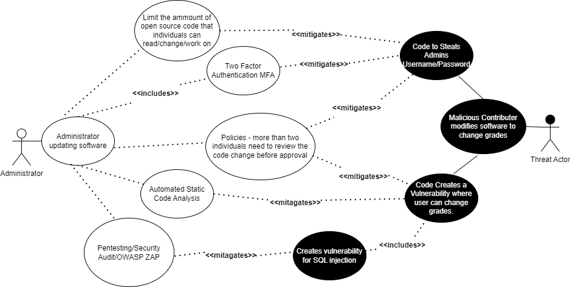
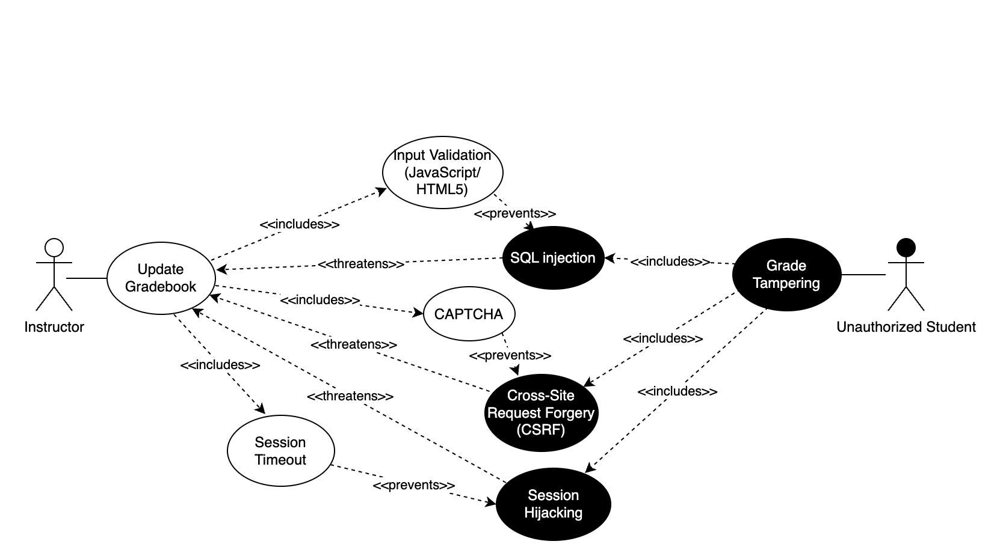
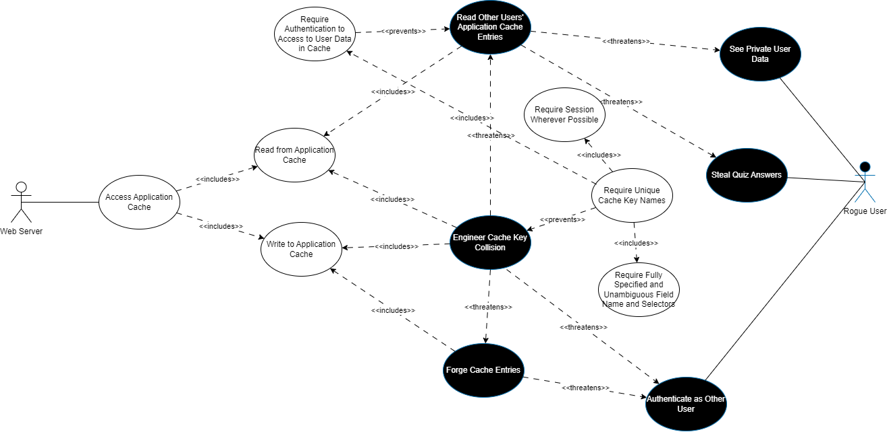
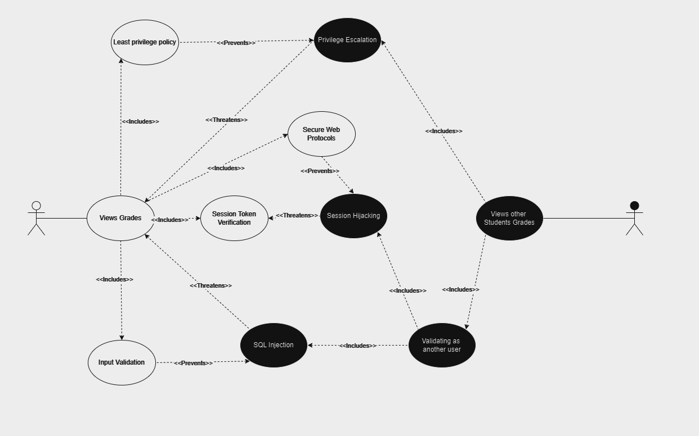

## CYBR-8420 Requirements for Software Security Engineering

## Use Case Diagrams

### Misuse Case 1 - Administrator Updating Software

**Use Case**

An administrator is trying to update the source code to fix some minor issues.

**Misuse Case**

A malicious contributor modifies the code in the hopes that the administrator updates the program with their code, for the intent of stealing administrators log in credentials or creating new vulnerabilities so the threat actor can modify student grades.

### Misuse Case 2 - Student updates gradebook

**Use Case**

An instructor logs into the gradebook system to update students' grades.

**Misuse Case**

An unauthorized student gains access to the gradebook system with an objective to manipulate the gradebook, either by altering their own grades or those of their peers by using Session Hijacking, Cross-Site Request Forgery (CSRF), or SQL injection.

### Misuse Case 3 - Rogue User Gains Unauthorized Access to Application Cache

**Use Case**

The web server accesses the application cache to improve user experience and reduce load on the database server.

**Misuse cases**

A rogue user manipulates the access cache to authenticate as a different user, to steal private information from other users, or to view quiz answers.

### Misuse Case 4 - Institution admin adds a user

**Use Case**

An institution admin adds a user to the system (Professor, student, admin, etc..).

**Misuse Case**

A malicious user/hacker creates an unauthorized user utilizing techniques like SQL injection, cross-site scripting, man-in-the-middle, insecure direct object references, and brute force attacks.

### Misuse Case 5 - Student views a grade

**Use Case**

A student is trying to access their grades.

**Misuse Case**

An unauthorized user validates as another user or another user as a user with higher privilege, and uses it to view other students' grades. 

## AI Prompt

While working on my Misuse Case, I initially created a chart that resembled more of a spaghetti dinner. I had way too many circles, prompts, solutions, and lines going everywhere. It was hard for me to pinpoint what I needed to do and clear the mess so it wasn’t impossible to read. After using a few prompts on ChatGPT, I was able to eliminate a lot of the issues I had and ended up with a clearer diagram. Some of my prompts were:

**Prompt**  
 Pretend you are a senior developer working on open-source software. Give me 5 issues that a malicious contributor can create and 5 solutions.

**Answer**  
 As a senior developer working on an open-source software project, here are five issues that a malicious contributor could introduce, along with five solutions to mitigate these risks: 

#### *Issues a Malicious Contributor Can Create:*
1. *Backdoor Implementation*  
   A malicious contributor might add hidden backdoors into the code, allowing unauthorized access to the system.
2. *SQL Injection Vulnerabilities*  
   They could introduce insecure code that is vulnerable to SQL injection attacks, compromising the application's database.
3. *Credential Theft*  
   The contributor may modify code to collect and exfiltrate sensitive information, such as admin passwords or tokens, to an external server.
4. *Malicious Dependencies*  
   They might introduce or modify dependencies that include malware or have known vulnerabilities, compromising the security of the entire application.
5. *Denial of Service (DoS) Mechanisms*  
   A contributor could insert code that triggers a resource exhaustion or infinite loop, leading to performance issues or system crashes, causing a denial of service.

#### *Solutions to Mitigate These Issues:*
1. *Code Review and Approval Process*  
   Enforce strict peer-review processes for every contribution. Ensure that multiple trusted developers review and approve code changes before they are merged into the main project.
2. *Automated Static Code Analysis*  
   Use automated tools (e.g., SonarQube, Checkmarx) to scan code for vulnerabilities such as backdoors, SQL injection risks, and other security flaws before accepting contributions.
3. *Dependency Scanning Tools*  
   Implement automated tools (like Dependabot, Snyk) to scan for vulnerabilities in third-party dependencies and ensure only safe libraries are used in the project.
4. *Penetration Testing and Security Audits*  
   Conduct regular penetration tests and security audits on the project, especially after significant changes. Use tools like OWASP ZAP or Burp Suite to identify potential vulnerabilities.
5. *Digital Signature Verification for Contributions*  
   Use digital signatures for all commits to ensure that code is coming from a trusted contributor. Additionally, restrict merge privileges to a small group of trusted maintainers who review all contributions.

By implementing these safeguards, you can significantly reduce the risk of malicious contributions compromising the security of an open-source project.

---

## List of Security Requirements derived from misuse case analysis

 - Input Validation- Implement strict input validation to defend against SQL injection attacks using JavaScript or HTML5 to manage input validation parameters.
 - Access Control- Utilize session timeouts and CAPTCHA as means of access control. Session timeouts log a user out after a predetermined duration of inactivity. CAPTCHA requires text-based, image-based, or audio verification to prevent unauthorized access.
 - Rate Limiting - Limit the amount of requests from a user/device to prevent brute force attempts and DDOS attacks.
 - Multi-factor Authentication - Utilize multiple authentication methods to prevent unauthorized access to accounts, especially privileged ones.
 - Audit Logging - Keeping detailed logs of user interactions with the system in order to detect and prevent misuses.
 - Indirect References - Utilize indirect references (use claims/token to validate user/input) to prevent insecure direct object references.
 - HTTPS - Ensure all web traffic is served over HTTPS by using SSL/TLS certificates.
-	Automated Static Code Analysis - Implement tools that automatically analyze the codebase for potential vulnerabilities and suspicious changes to catch issues early.
-	Penetration Testing / Security Audits - Regularly conduct penetration tests or security audits to identify vulnerabilities that may have been introduced, using tools like OWASP ZAP to find injection flaws or other weaknesses.
-	Trusted Contributor Programs - Limit write access to trusted contributors or maintainers and use digital signatures for contributions to ensure code authenticity.
-	Fully Specified Cache Entry Names incorporating session id, unique field identifier, and user id.
-  Additional Cache Security Controls: While somewhat out of scope, these could include purging/expiration, rate limiting, encryption, monitoring/logging, and constant time access.
-  Least Privilege Policy - Limits user access to only the resources they need to perform their job responsibilities.

## Security Requirements Assessment

Canvas LMS advertises the following security features that mitigate security requirements derived from the misuse case analyses.

 - Input Validation:
   - CSRF Protection / Cross-Site Scripting (XSS) Protection
   - Audit Logs

 - Access Controls:
   - Session Timeouts
   - Role-Based Access Control (RBAC)
 - Automated Static Code Analysis:
   - All code goes through a developer peer-review process before it is merged into the code base repository
   - All application builds are automatically scanned for security vulnerabilities and must pass prior to deployment.
 - Pentesting/Security Audits:
   - Canvas-LMS did not mention what program they used for Pentesting, potential recommendation OWASP ZAP.
   - Private Bug Bounty Program
- Trusted Contributor Program:
   - Private Bug Bounty Program, users have to apply and submit their Bugcrowd profile.
 
## Security-related Configuration and Installation Issues Documentation Review

Canvas LMS generally has thorough and impressive documentation on its software installation and configuration. However, there were some security-related holes present in the documentation. We reviewed both the Quick Start and Production Start OSS documentation and discovered the following potential shortfalls:

### *Quick Start*

 1. Documentation doesn't clearly emphasize the importance of changing default username and passwords.
 2. Instructions are not provided for applying security patches and updates.

### *Production Start*

 1. Environmental security isn't addressed, neglecting the security of the hosting environment, such as cloud configurations and firewall settings.
 2. Documentation lacks emphasis on using HTTPS over HTTP and could clarify that users should avoid using any unsecured protocols.
 3. The instructions assume a certain level of familiarity with the software, risking the chance that less experienced users may inadvertently expose themselves to security risks.
 4. While instructions do mention inserting randomized strings of at least 20 characters in the security.yml files, there is not guidance on how to generate these strings securely (e.g. - through the use of a password manager, cryptographic library, or command-line tool)
 5. The interactive prompt for creating an administrator account doesn't mention the importance of using a strong, unique password (based on a robust password policy).
 6. The documentation briefly mentions Redis and memcache support but lacks specific guidance on application cache configuration and authentication. While cache server security is out of scope, the security of communications with the cache server are not. Compromised cache access could cause a complete failure of Canvas user authorization mechanisms. For this reason, some configuration recommendations would be appropriate.
 7. The documentation should emphasize regular updates and patching to ensure security vulnerabilities are addressed.
 8. The documentation lacks security recommendations when setting up the database. They should recommend using encrypted connections and securely storing database credentials.

## Link to Project Board
[Click here to view the board](https://github.com/users/jschrack/projects/2/views/1)

## Individual Contributions

### Augusto

- Completed misuse case analysis for Administrator Updating Software.
- Built a list of security requirements derived from misuse case analysis, and used AI (ChatGPT) to improve my assessment.
  
### Deb

- Completed misuse case analysis for the instructor / gradebook relationship
- Built list of security requirements derived from misuse case analysis and compared them to advertised security features of software to determine sufficiency of current security features
- Researched OSS security configuration / installation documentation for Canvas LMS and contributed this section in "Part 2" of the assignment
- Completed the Team Reflection for this week's assignment
  
### Geoff

- Completed misuse case analysis for application cache access
- Built list of security requirements derived from misuse case analysis
- Asked Google Gemini if it had any more ideas

### Jesse

- Completed misuse case analysis for adding a user.
- Added security requirements derived from analysis to the list of security requirements. 
- Added improvements/recommendations for improving the production quickstart documentation.
  
### Mark

- Completed use case/misuse case chart for a student viewing a grade.
- Added relevant security requirements and added to security requirements assessment from the misuse case. 

## Team Reflection

Our team continues to work well together. We set up regular team meetings to check in with one another, ensuring we're on the same page and understand our coursework and roles in our assignments. Everyone is respectful and helpful in conveying their ideas. We made sure to incorporate comments into our pull request (PR) reviews, using feedback from Dr. Gandhi to refine our process. The one area that we all agreed could use some improvement was submission of our individual assignment contributions earlier in the week, allowing other teammates ample time to review PRs, provide comments, and update our product. Overall, we all continue to maintain our best efforts and are eager to learn how we can improve going forward.
